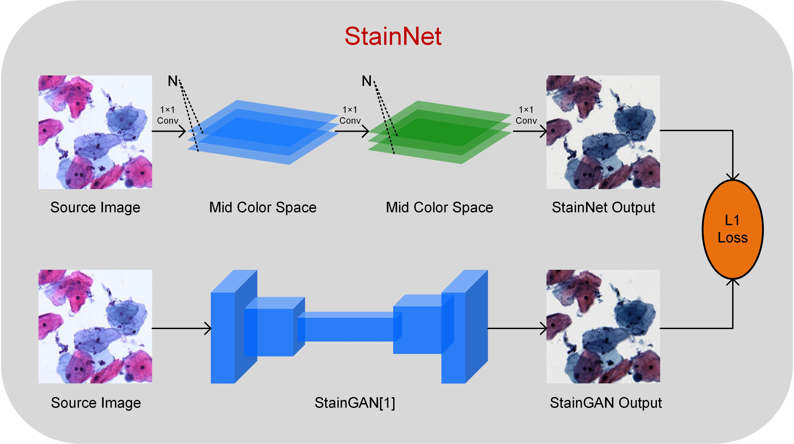

# StainNet: Robust and Fast Stain Normalization Network

## 1、Our approach



You can see the [demo.ipynb][demo.ipynb] for details

## 3、Requirements

Python 3.6 or later with all [requirements.txt](https://github.com/khtao/StainNet/blob/master/requirements.txt) dependencies installed, including `torch>=1.0`. To install run:

```bash
pip install -r requirements.txt
```

## 4、Testing and Training

```bash
python test.py -h
  --source_dir SOURCE_DIR
                        path to source images for test
  --gt_dir GT_DIR       path to ground truth images for test
  --method METHOD       different methods for test must be one of { StainNet StainGAN reinhard macenko vahadane khan }
  --test_ssim           whether calculate SSIM , default is False
  --random_target       random choose target or using matched ground truth, True is random choose target
  --input_nc INPUT_NC   # of input image channels
  --output_nc OUTPUT_NC
                        # of output image channels
  --channels CHANNELS   # of channels in StainNet
  --n_layer N_LAYER     # of layers in StainNet
  --model_path MODEL_PATH
                        models path to load

```

```shell
python train.py -h
  --source_dir SOURCE_DIR
                        path to source images for test
  --gt_dir GT_DIR       path to ground truth images for test
  --method METHOD       different methods for test must be one of { StainNet StainGAN reinhard macenko vahadane khan }
  --test_ssim           whether calculate SSIM , default is False
  --random_target       random choose target or using matched ground truth, True is random choose target
  --input_nc INPUT_NC   # of input image channels
  --output_nc OUTPUT_NC
                        # of output image channels
  --channels CHANNELS   # of channels in StainNet
  --n_layer N_LAYER     # of layers in StainNet
  --model_path MODEL_PATH
                        models path to load
(pytorch) khtao@khtao-PC:~/workplace/WorkCenter/2020-9/StainNet$ python train.py -h
usage: train.py [-h] [--name NAME] [--source_root_train SOURCE_ROOT_TRAIN] [--gt_root_train GT_ROOT_TRAIN] [--source_root_test SOURCE_ROOT_TEST]
                [--gt_root_test GT_ROOT_TEST] [--input_nc INPUT_NC] [--output_nc OUTPUT_NC] [--channels CHANNELS] [--n_layer N_LAYER] [--batchSize BATCHSIZE]
                [--nThreads NTHREADS] [--checkpoints_dir CHECKPOINTS_DIR] [--fineSize FINESIZE] [--display_freq DISPLAY_FREQ] [--test_freq TEST_FREQ] [--lr LR]
                [--epoch EPOCH]

optional arguments:
  -h, --help            show this help message and exit
  --name NAME           name of the experiment.
  --source_root_train SOURCE_ROOT_TRAIN
                        path to source images for training
  --gt_root_train GT_ROOT_TRAIN
                        path to ground truth images for training
  --source_root_test SOURCE_ROOT_TEST
                        path to source images for test
  --gt_root_test GT_ROOT_TEST
                        path to ground truth images for test
  --input_nc INPUT_NC   # of input image channels
  --output_nc OUTPUT_NC
                        # of output image channels
  --channels CHANNELS   # of channels in StainNet
  --n_layer N_LAYER     # of layers in StainNet
  --batchSize BATCHSIZE
                        input batch size
  --nThreads NTHREADS   # threads for loading data
  --checkpoints_dir CHECKPOINTS_DIR
                        models are saved here
  --fineSize FINESIZE   crop to this size
  --display_freq DISPLAY_FREQ
                        frequency of showing training results on screen
  --test_freq TEST_FREQ
                        frequency of cal
  --lr LR               initial learning rate for SGD
  --epoch EPOCH         how many epoch to train

```

### test FPS

```shell
python test_fps.py
```

