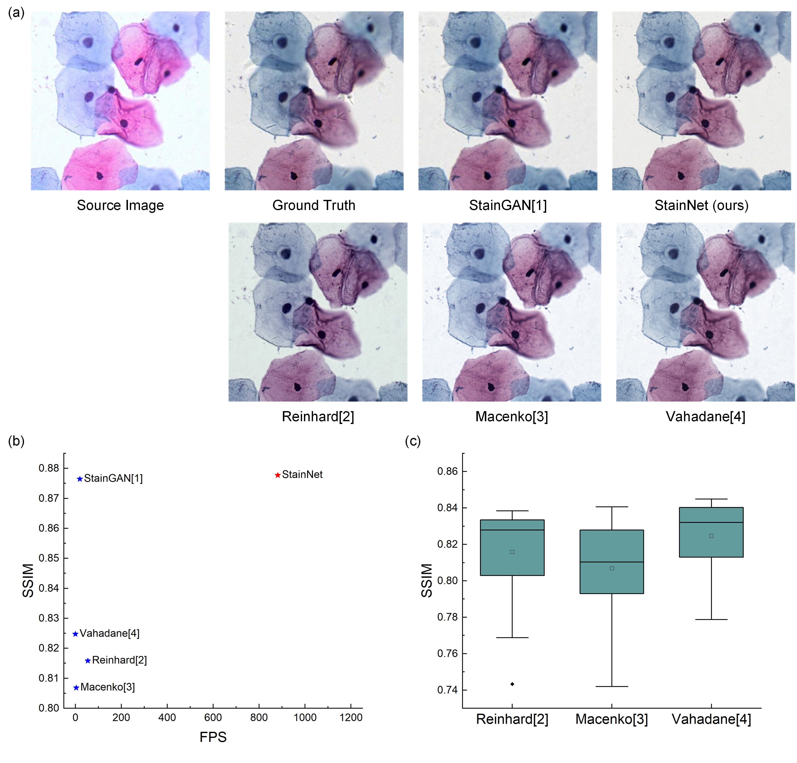
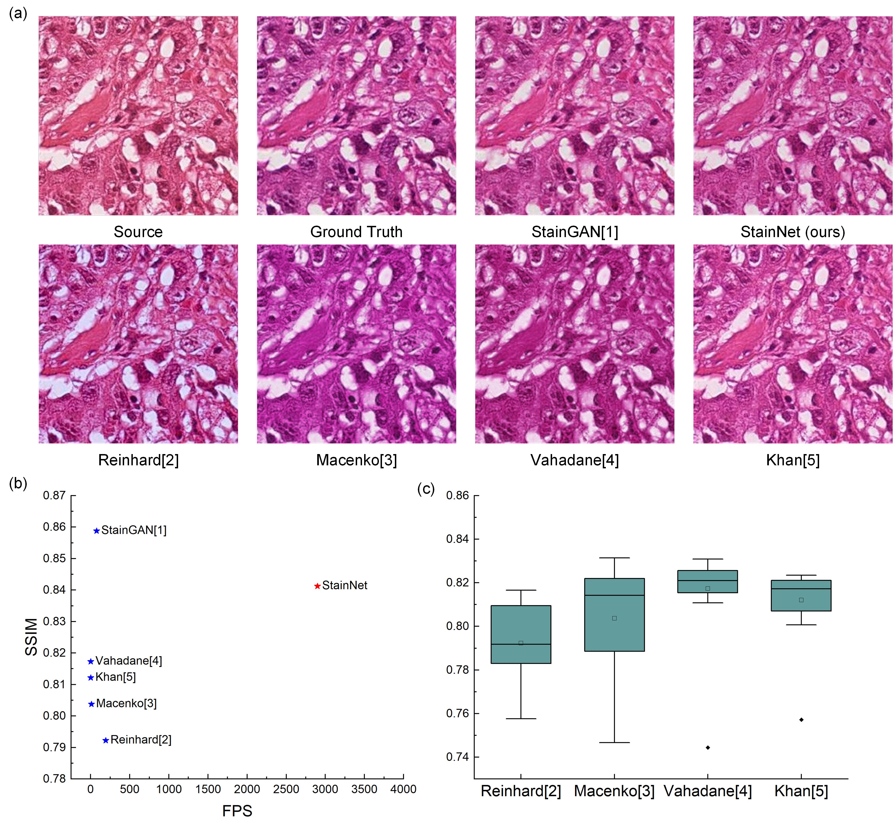

# StainNet: Robust and Fast Stain Normalization Network

## 1、Our approach


## 2、Our results





## 3、Requirements

Python 3.6 or later with all [requirements.txt](https://github.com/khtao/StainNet/blob/master/requirements.txt) dependencies installed, including `torch>=1.0`. To install run:

```bash
pip install -r requirements.txt
```

## 4、Testing and Training


### Run all tests

```bash
sh scripts/test_Cytopathology.sh # for Cytopathology
sh scripts/test_Histopathology.sh # for Histopathology
```

### Prepare training data

```shell
sh scripts/make_train_data_Cytopathology.sh # for Cytopathology
sh scripts/make_train_data_Histopathology.sh # for Histopathology
```

### Run training

```shell
sh scripts/train_cytopathology.sh # for Cytopathology
sh scripts/train_histopathology.sh # for Histopathology
```

