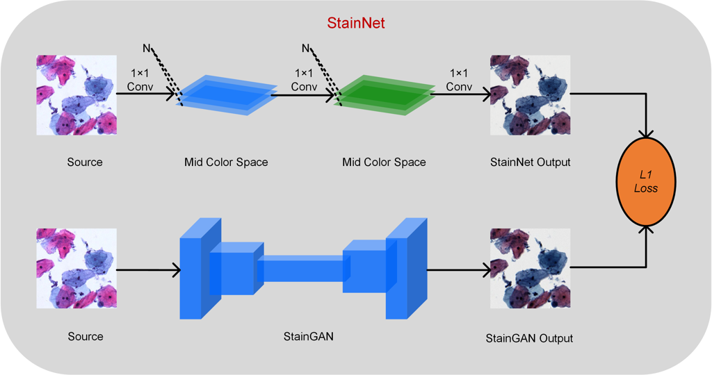

# StainNet: a fast and robust stain normalization network

The code and dataset  for StainNet with url: https://doi.org/10.3389/fmed.2021.746307
please cite our paper if you use the code or dataset

## 1、Our approach



You can see the [demo.ipynb](demo.ipynb) for details

## 2、Requirements

Python 3.6 or later with all [requirements.txt](https://github.com/khtao/StainNet/blob/master/requirements.txt) dependencies installed, including `torch>=1.0`. To install run:

```bash
pip install -r requirements.txt
```

## 3、Dataset Download

We make the aligned histopathology dataset and the histopathology classification dataset in our paper publicly available.  They can be downloaded from BaiduYun as follow:

BaiduYun url:https://pan.baidu.com/s/1_k7l3wL0vrP26Yc6kkcWEQ 
Extraction code：wrfi

The related descriptions are below:

| Filename                      | Descriptions                                                 |
| ----------------------------- | ------------------------------------------------------------ |
| aperio_hamamatsu.zip          | The aligned histopathology dataset from the publicly available part of the MITOS-ATYPIA ICPR’14 challenge. |
| camelyon16.zip                | The histopathology classification dataset from the publicly available Camelyon16 dataset for train classifier |
| camelyon16_for_train_norm.zip | From the publicly available Camelyon16 dataset for train normalization model |

## 4、Train StainGAN 

```bash
git clone https://github.com/khtao/StainGAN.git
cd StainGAN
# train the aligned histopathology dataset
python train.py --dataroot  aperio_hamamatsu/train --phaseA aperio  --phaseB hamamatsu --batchSize 4 --niter 25  --niter_decay 25 --loadSize 256 --fineSize 256 --name aperio_hamamatsu --display_env aperio-hamamatsu --model cycle_gan --no_dropout 

# train the histopathology classification dataset for norm 
python train.py --dataroot  camelyon16_for_train_norm --phaseA centerUni  --phaseB centerRad --batchSize 4 --niter 100  --niter_decay 100 --loadSize 256 --fineSize 256 --name aperio_hamamatsu --display_env aperio-hamamatsu --model cycle_gan --no_dropout 
```

## 5、Train and Test StainNet

```bash
python test.py -h
  --source_dir SOURCE_DIR
                        path to source images for test
  --gt_dir GT_DIR       path to ground truth images for test
  --method METHOD       different methods for test must be one of { StainNet StainGAN reinhard macenko vahadane khan }
  --test_ssim           whether calculate SSIM , default is False
  --random_target       random choose target or using matched ground truth, True is random choose target
  --input_nc INPUT_NC   # of input image channels
  --output_nc OUTPUT_NC
                        # of output image channels
  --channels CHANNELS   # of channels in StainNet
  --n_layer N_LAYER     # of layers in StainNet
  --model_path MODEL_PATH
                        models path to load

```

```shell
python train_StainNet.py -h
  --name NAME           name of the experiment.
  --source_root_train SOURCE_ROOT_TRAIN
                        path to source images for training
  --gt_root_train GT_ROOT_TRAIN
                        path to ground truth images for training
  --source_root_test SOURCE_ROOT_TEST
                        path to source images for test
  --gt_root_test GT_ROOT_TEST
                        path to ground truth images for test
  --input_nc INPUT_NC   # of input image channels
  --output_nc OUTPUT_NC
                        # of output image channels
  --channels CHANNELS   # of channels in StainNet
  --n_layer N_LAYER     # of layers in StainNet
  --batchSize BATCHSIZE
                        input batch size
  --nThreads NTHREADS   # threads for loading data
  --checkpoints_dir CHECKPOINTS_DIR
                        models are saved here
  --fineSize FINESIZE   crop to this size
  --display_freq DISPLAY_FREQ
                        frequency of showing training results on screen
  --test_freq TEST_FREQ
                        frequency of cal
  --lr LR               initial learning rate for SGD
  --epoch EPOCH         how many epoch to train

```

### test FPS

```shell
python test_fps.py
```

## 6、Train and eval Classifier

```bash
#train Classifier
python train_Classifier.py
#evel Classifier
python eval_Classifier.py
```

